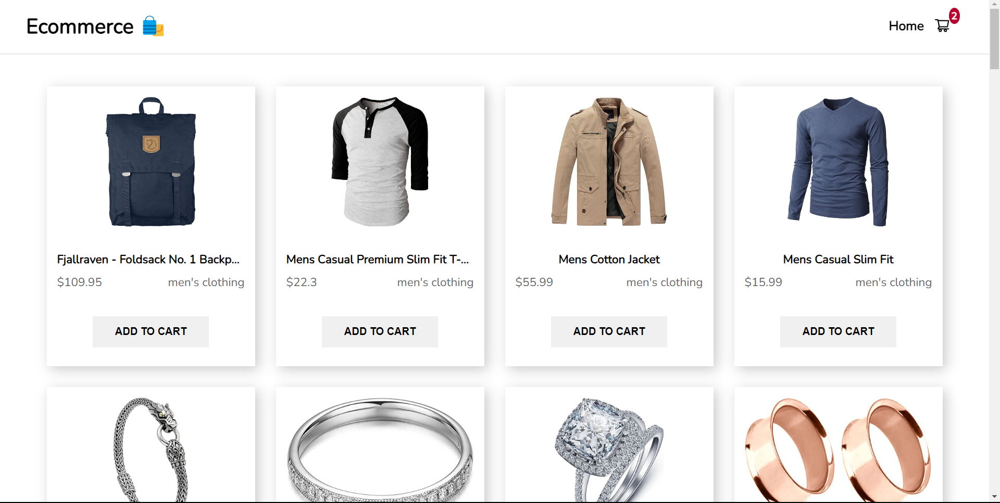

# Ecommerce Store 🛍️

  
  
## Features

- **Product Listings :** 🍽️ Display a list of Product with details and Product items.
- **Menu Navigation :** 📜 Users can browse Product menus and add items to their cart.
- **Fetch API :** ✅ 
Fetch fake API for dynamic website updates, enhancing user experience.
- **Infinite Scrolling :** 🔄 Implement infinite scrolling to load more restaurant listings as users scroll down the page.
- **Lazy Loading :** ⚡ Experience faster page loading with lazy loading for your order summary.
- **Removing Items from Cart :** 🗑️ Users can remove individual items from their shopping cart without clearing the entire cart.
- **Clear Cart Functionality :** 🛒 Provide an option for users to clear their entire shopping cart with a single action.
- **Order Summary :** 📦 Display a summary of the order, including items, quantities, and total cost.
- **Submit Payment :** 🚀 Include a button for users to confirm and submit their payment.
- **Responsive Website :** 📱website is responsive and looks good on various screen sizes.
- **Toast :** 📦 Successfully added items to your cart! 

## Getting Started

Follow these instructions to set up and run the project locally on your machine.

### Prerequisites

- Node.js and npm installed on your system.

### Installation

1. Clone the repository: `git clone https://github.com/your-username/InstantEats.git`
2. Navigate to the project directory: `cd InstantEats`
3. Install dependencies: `npm install`
4. Start the development server: `npm start`

---

Happy ordering! 🚀
